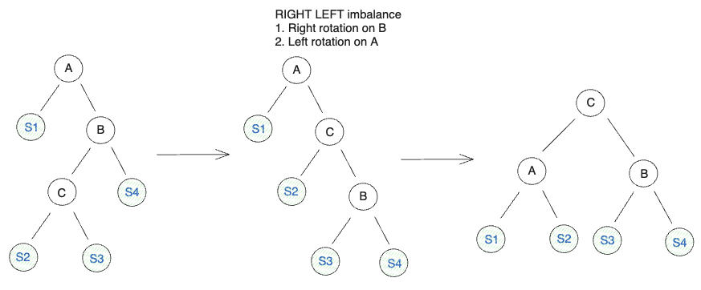

# AVL Tree

An AVL tree is a self-balancing Binary Search Tree, where the height difference of the left and right subtrees differs by at most one, otherwise they will be rebalanced.

## Rotations
Rebalancing is done through four different types of rotations, depending on the situation.




## AVL Tree Rotations

### Left-Left Rotation
The tree is inbalanced in the left child of the left child (of the root).  
A `right rotation` must be performed to balance the heights.

### Right-Right Rotation
The tree is inbalanced in the right child of the right child (of the root).  
A `left rotation` must be performed to balance the heights.

### Left-Right Rotation
The tree is inbalanced in the right child of the left child (of the root).
1. Perform a left rotation on node.left to turn it into a `left-left rotation` case.
2. Perform a `right rotation` to balance the heights.

### Right-Left Rotation
The tree is inbalanced in the left child of the right child (of the root).
1. Perform a right rotation on node.right to turn it into a `right-right rotation` case.
2. Perform a `left rotation` to balance the heights.

## Usage

### Initialization

If no comparator function is passed in, the default `(a, b) => a - b` will be used
```
const avlTree = new AVLTree();
```

With comparator function
```
const avlTree = new AVLTree((a, b) => b - a);
```

### find

Finds the node with the given value.  
Returns `null` if the value doesn't exist in the tree. 

Time Complexity: `O(log(n))`

```
const node = avlTree.find(5);
```

### has

Returns `true` if the tree contains the given value, otherwise returns `false`.  

Time Complexity: `O(log(n))`

```
const exists = avlTree.has(10);
```

### insert

Inserts a node with the given value into the tree.   
Returns the root of the tree.  

**Implementation**:  
Traverses the tree based on the given value and inserts a new node on the first empty position.

Time Complexity: `O(log(n))`

```
const root = avlTree.insert(3);
```

### remove

Removes the node with the given value from the tree.  
If there are multiple nodes with the same value, then we remove any one node that matches.  
Returns the root of the tree.  

Four scenarios for deletion:
1. Node to delete has no children - just delete it
2. Node to delete only has a left child - replace it with the left child
3. Node to delete only has a right child - replace it with the right child
4. Node to delete has both left and right children - replace it with the next smallest node that is larger (use in order traversal to find the leftmost node in the right child)
    - Swap the node values with the smallest node that is larger
    - Remove the smallest node from the right subtree
    - The right subtree becomes the right child of the replacement node, which is valid because this value was previously the smallest in the subtree

Time Complexity: `O(log(n))`

```
const root = avlTree.remove(4);
```

### getKthLargestNode

Returns the kth (1-indexed) largest node in the tree.  
Returns `null` if there are less than `k` nodes.  

Time Complexity: `O(log(n))`

```
const kthLargestNode = avlTree.kthLargestNode(1);
```

### getKthLargest

Returns the kth (1-indexed) largest value in the tree.  
Returns `null` if there are less than `k` nodes.  

Time Complexity: `O(log(n))`

```
const kthLargest = avlTree.kthLargest(3);
```

### getKthSmallestNode

Returns the kth (1-indexed) smallest node in the tree.  
Returns `null` if there are less than `k` nodes.  

Time Complexity: `O(log(n))`

```
const kthSmallestNode = avlTree.kthSmallestNode(1);
```

### getKthSmallest

Returns the kth (1-indexed) smallest value in the tree.  
Returns `null` if there are less than `k` nodes.  

Time Complexity: `O(log(n))`

```
const kthSmallest = avlTree.kthSmallest(3);
```

### lowerBoundNode

Returns the leftmost node where the node value is greater than or equal to the given value based on the comparator function.   
Returns `null` if there are no nodes in the tree greater than or equal to the given value.  

Time Complexity: `O(log(n))`

```
const lowerBoundNode = avlTree.lowerBoundNode(5);
```

### lowerBound

Returns the leftmost value greater than or equal to the given value based on the comparator function.  
Returns `null` if there are no values greater than or equal to the given value.  

e.g. If there are values `[1,2,5,7,9]` in the tree, the lower bound for value `6` is `7`.  

Time Complexity: `O(log(n))`

```
const lowerBound = avlTree.lowerBound(6);
```

### upperBoundNode

Returns the rightmost node where the node value is smaller than or equal to the given value based on the comparator function.   
Returns `null` if there are no nodes in the tree smaller than or equal to the given value.  

Time Complexity: `O(log(n))`

```
const upperBoundNode = avlTree.upperBoundNode(5);
```

### upperBound

Returns the right value smaller than or equal to the given value based on the comparator function.  
Returns `null` if there are no values smaller than or equal to the given value.  

e.g. If there are values `[1,2,5,7,9]` in the tree, the upper bound for value `6` is `5`.  

Time Complexity: `O(log(n))`

```
const upperBound = avlTree.upperBound(6);
```
